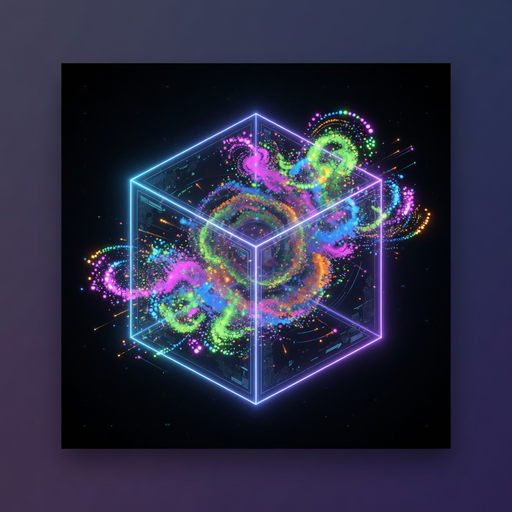

# custom-gpu-dem

<p align="center">
  
</p>


High-performance single-GPU Discrete Element Method (DEM) code using CuPy.

## Highlights (why this one)

- **Physical boundaries**: Force-based (not mass-scaled acceleration) walls/floor + velocity reflection. Much more stable with stiff Hertz + cohesion.
- **Device-side cell list + single RawKernel**: Scales to 10k–20k+ particles on one GPU without host syncs in the hot path.
- **Real gas drag + porosity**: Stokes + quadratic with local porosity correction and `drag_mult=1.0` support (important for physical low-pressure runs).
- **Reproducible high-N scaling**: Start from a settled small-N state and add particles with controlled jitter. Preserves containment statistics.
- **Physical lid + freeboard**: Built-in support for contained fluidized beds (soft damping + hard cap).
- Pure Python + CuPy. Easy to hack.

Originally extracted and cleaned from the RCFX (lunar regolith iron-shot heat recovery) patent evidence campaign.

## Quick Start

```bash
pip install -e .
# (you must have a working CuPy for your CUDA version first)

python -m custom_gpu_dem run   # (uses defaults)

# or programmatically
python examples/simple_settling.py
```

See `docs/user-guide.md` (to be expanded) and the examples/.

## Core API

```python
from custom_gpu_dem import DEMSimulation, DEMConfig

cfg = DEMConfig(n_particles=8000, iron_frac=0.07, physical_drag_only=True, u_g=0.066)
sim = DEMSimulation(cfg)
sim.initialize_particles()          # replace with your generator for production
for _ in range(2000):
    sim.step()
sim.write_vtk("out/particles.vtu")
```

## Configuration

See `config.py`. You can pass a dict or a YAML file.

## Output

- `write_vtk(...)` → ParaView-readable .vtu (points + radius, material, velocity, ...)
- `save_checkpoint(...)` / `from_checkpoint(...)` for restart.

## Performance Notes

- For N > ~4000 use the cell list (default in high-level API).
- Tune `cell_size` (0.003–0.006 is typical for 18 mm box with mm-scale particles).
- The "base + jitter add" trick in `highn_sensitivity.py` style is excellent for scaling while keeping physical statistics.

## Extending

The contact kernel lives in `core/dem_kernels.py`. The integration step is in `core/optimized_step.py`.

Add new material models or forces by extending the kernels and passing extra arrays.

## License

MIT (see LICENSE).

## Citation / Origin

Developed as part of the RCFX low-pressure fluidized bed heat recovery modeling for patent evidence (PERRY-RCFX-004). The clean physical-lid, real-drag-only good-variable data (1.5 mm iron at 3.5 m/s) and the reproducible runner are the core validated pieces.

If you use this for research, a citation to the original RCFX work / patent (once published) would be appreciated.
